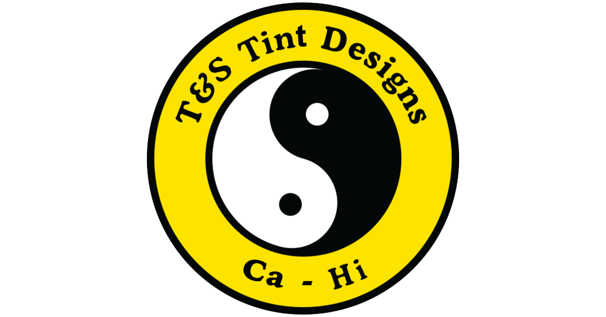
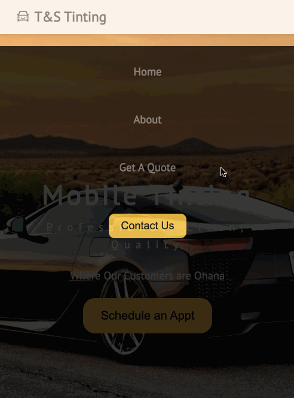

# TNS Tinting

# Introduction

T&S Tint Designs provides an easy, user-friendly solution for customers to receive free quotes for mobile window tinting. Once the user selects their preferences, a quote will be given, in which the user can set up an appointment if they would like to proceed.

# What does the app do?

- To offer customers a free quote based on year, make, and model of their vehicle
- To allow customers to make an appointment based on form information

# Tech stack

- [Express](https://expressjs.com/)
- [Node.js](https://nodejs.org/en/)
- [React](https://reactjs.org/)
- APIs:
    - [Vehicle API](https://vpic.nhtsa.dot.gov/api/)
    - [Twilio](https://www.twilio.com/docs/usage/api)

# Video Demo / Screen shot walkthrough of the app

- [Demo](https://youtu.be/8zc-8pNdoLo)

- As a customer:

# How does the app work?

- Customers: The application provides a sleek UI for customers to be able to easily receive a free quote based on their form submission. They will also be able to make an appointment if the quote they received was acceptable. Once the user creates an appointment, a text message will be sent to owner stating that an appointment was made.

# Available Scripts

In the project directory, you can run:

### `npm start`

Runs the app in the development mode.\
Open [http://localhost:3000](http://localhost:3000) to view it in the browser.

Your app is ready to be deployed!

